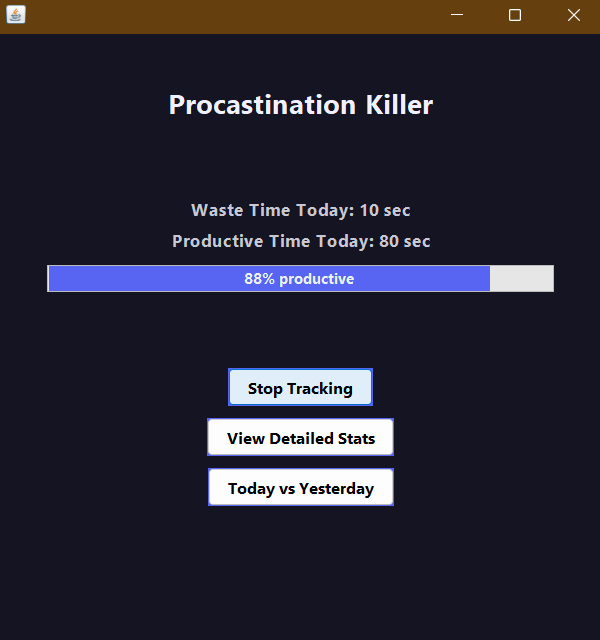

# ⚔️ Procrastination Killer

A Windows desktop productivity tool built in Java that tracks your active application usage in real time — helping you stay aware of where your time actually goes and cut out distractions.


---

## 📋 Table of Contents

- [Features](#features)
- [Tech Stack](#tech-stack)
- [Project Structure](#project-structure)
- [Prerequisites](#prerequisites)
- [Build from Source](#build-from-source)
- [Run the App](#run-the-app)
- [Install via Installer](#install-via-installer)
- [How It Works](#how-it-works)
- [Contributing](#contributing)

---

## ✨ Features

- 🖥️ **Active Window Tracking** — Monitors which application has focus in real time using native Windows APIs
- 📊 **Usage Analytics** — Logs time spent per application and surfaces patterns in your day
- 💾 **Persistent Data** — Saves session data to JSON for historical review across sessions
- 📦 **Single Executable** — Ships as a self-contained fat JAR with no external runtime dependencies
- 🔧 **Installer Ready** — Includes a `dist-installer` for easy setup on Windows machines

---

## 🛠 Tech Stack

| Component       | Technology                         |
|-----------------|------------------------------------|
| Language        | Java 17                            |
| Build Tool      | Apache Maven                       |
| Windows API     | JNA + JNA Platform (User32, Psapi) |
| Data Storage    | Gson (JSON)                        |
| Packaging       | Maven Shade Plugin (fat JAR)       |

---

## 📁 Project Structure

```
Procrastination-Killer/
├── src/
│   └── main/java/com/showmee/prokiller/
│       └── Main.java            # Application entry point
├── dist-installer/              # Windows installer files
├── target/                      # Compiled output (generated)
├── pom.xml                      # Maven build configuration
└── dependency-reduced-pom.xml   # Generated by shade plugin
```

---

## ✅ Prerequisites

- [Java 17+](https://adoptium.net/) (JDK)
- [Apache Maven 3.8+](https://maven.apache.org/download.cgi)
- Windows OS (required for JNA Windows API calls)

Verify your setup:

```bash
java -version
mvn -version
```

---

## 🔨 Build from Source

```bash
# Clone the repository
git clone https://github.com/Som-02/Procrastination-Killer.git
cd Procrastination-Killer

# Build the fat JAR
mvn clean package
```

The compiled JAR will be available at:

```
target/procrastination-killer-fat.jar
```

---

## ▶️ Run the App

```bash
java -jar target/procrastination-killer-fat.jar
```

> ⚠️ Must be run on **Windows**. The app uses JNA to call Win32 APIs (`User32`, `Psapi`) for active window detection.

---

## 📦 Install via Installer

A pre-built installer is available in the `dist-installer/` folder. Simply run the installer on your Windows machine to set up the application without needing to build from source.

---

## ⚙️ How It Works

1. On launch, the app polls the active foreground window using the Windows `User32` API
2. It identifies the process name behind each window via `Psapi`
3. Time spent in each application is accumulated and saved to a local JSON file using Gson
4. On subsequent launches, past session data is loaded so usage history is preserved

---

## 🤝 Contributing

Contributions are welcome! To get started:

1. Fork the repository
2. Create a new branch: `git checkout -b feature/your-feature-name`
3. Commit your changes: `git commit -m "Add: your feature description"`
4. Push to the branch: `git push origin feature/your-feature-name`
5. Open a Pull Request

---

<div align="center">
  Made with ☕ by <a href="https://github.com/Som-02">Somnath</a>
</div>
